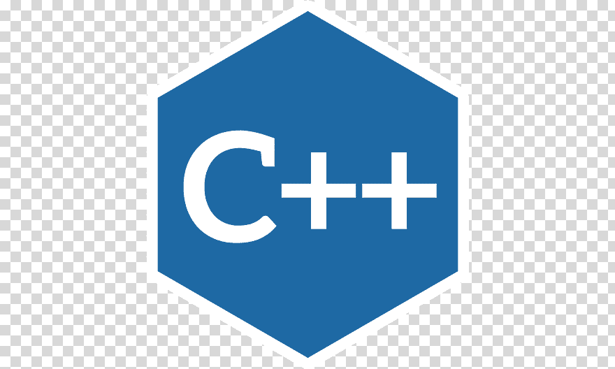

# Алгоритмизация и программирование

Автор: Плеханова Екатерина

|[Контест 1](https://contest.yandex.ru/contest/52142/problems/) |  |
| --- | :-: |
|<a href="https://github.com/EkaterinaPlehanova/Practica/blob/main/contest_01/01/main.cpp">1. Приближенное значение Пи </a> |   |
| [2. Кислород](./contest_01/02/main.go) |   |
| [3. Частное](./contest_01/03/main.cpp) |  |
| ... | ... |

|[Контест 2](https://contest.yandex.ru/contest/52676/problems/) |  |
| --- | :-: |
| [1. Функция. Простое число](./contest_02/01/main.cpp) |  |
| [2. Функция. Выход из лабиринта](./contest_02/02/main.go) |   |
| [3. Функция. Сортировка по количеству единиц](./contest_02/03/main.cpp) |  |
| ... | ... |

